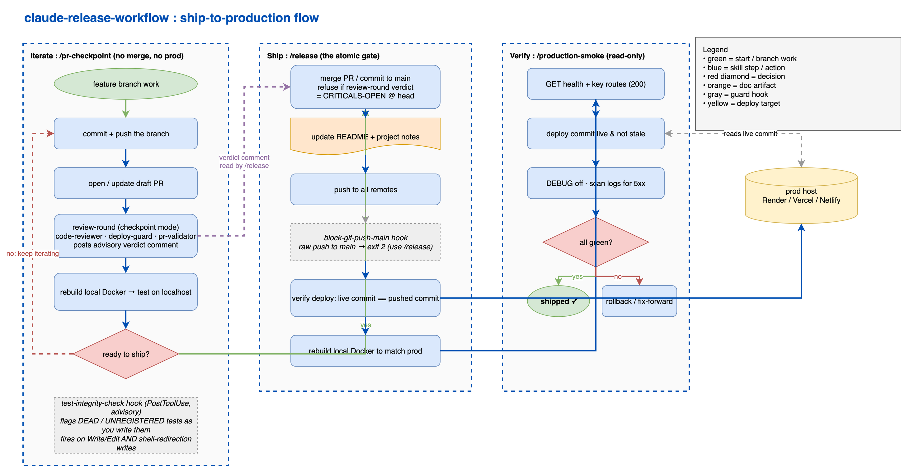

# Claude Release Workflow

A set of Claude Code skills and hooks for shipping code safely. It splits "ship it" into an iterate stage and a release stage, codifies the pre-release review loop, and puts a hook in front of `git push` so a release always goes through the skill instead of an ad-hoc push.

The idea is a small, repeatable path from a feature branch to a verified production deploy:

1. **pr-checkpoint**: snapshot in-progress work as a GitHub PR and rebuild your local Docker container so you can test the feature branch on localhost. Does not merge, does not touch prod. Optionally runs the review loop as advisory reports.
2. **review-round**: the codified three-reviewer loop. Author per-agent adversarial prompts aimed at the riskiest spots, launch the review agents in parallel, reproduce every finding by execution before fixing, prove each fix with a non-vacuous regression test, and post the PR verdict comment that `release` reads.
3. **release**: the single ship-it verb. Auto-detects PR mode (merge open PRs targeting main) or trunk mode (commit straight to main), updates the README and project notes, pushes to every remote, verifies the auto-deploy landed on the right commit, and rebuilds local Docker so localhost matches prod. Refuses to merge a PR whose review-round verdict at the current head is CRITICALS-OPEN.
4. **production-smoke**: a read-only check battery against the live service after a deploy: confirms the deployed commit matches what you pushed, hits the health endpoint and a few key routes, checks that debug mode is off in prod, and scans recent logs for tracebacks and 5xx.

A `block-git-push-main.sh` PreToolUse hook backs this up: it deterministically blocks any raw `git push` to `main` / `master` and points you at `/release`. It is the safety net for when the model forgets the workflow.

## The flow



Source: [docs/release-flow.drawio](docs/release-flow.drawio) (editable in draw.io).

## Why two verbs

`/pr-checkpoint` is the iterate stage. You run it as many times as you like while building a feature: it opens or updates a PR and gives you a running local container to test against, but it never merges or deploys, and does not touch your release docs (that would be premature).

`/release` is the hard gate. It is the one place that merges, updates docs, pushes, and deploys, all as one atomic action. Because the docs update and the deploy verification are part of the same step, you cannot ship code and forget to write down what changed.

## The skills

- **`pr-checkpoint`**: commit staged work, push the feature branch, open a draft PR with a structured body, optionally run the advisory review loop, and rebuild local Docker. Refuses to push to main or commit secrets, and (via the shared preflight) refuses to push AI-assistant harness files to a repo you do not own.
- **`review-round`**: the pre-release review loop (also the engine behind the `pr-checkpoint` step-6 review, in advisory checkpoint mode). Scopes the diff, authors adversarial per-agent prompts, launches the review agents in parallel, reproduces findings by execution, verifies suggested fixes against the authoritative gate, proves each fix with a mutation- or contrast-checked regression test, and posts a `Review-round verdict: <CLEAN|CRITICALS-OPEN> @ <sha>` comment. `release` reads that marker and refuses a CRITICALS-OPEN head.
- **`release`**: detects the release shape (PR / trunk / nothing to do), merges or commits, runs an optional project pre-push gate, updates README + project notes, pushes to all remotes, verifies the deploy landed on the correct commit, and rebuilds local Docker. Refuses to merge a PR whose review-round verdict at the current head is CRITICALS-OPEN (a missing or stale-SHA verdict is not a blocker).
- **`production-smoke`**: post-deploy verification. Strictly read-only (GETs, log reads, host-API reads). Reports pass / fail per check and recommends rollback or fix-forward on failure without executing either on its own.

Shared protocols the skills reference (in `_shared/`):

- **`release-docs.md`**: how the README and project notes get updated at ship time, plus the secrets / staging guardrails.
- **`local-docker-rebuild.md`**: detect and rebuild the repo's local container; skips silently when the project does not use Docker.
- **`harness-files-protection.md`**: a preflight that keeps AI-assistant working files (`CLAUDE.md`, `MEMORY.md`, `.claude/`, and so on) out of any repo you do not own personally.

The hooks (in `hooks/`):

- **`block-git-push-main.sh`**: PreToolUse hook on the Bash tool that blocks `git push` to main / master, with two documented bypasses for the rare direct-push case.
- **`test-integrity-check.py`**: PostToolUse hook (advisory) that catches DEAD tests (defined after a custom `if __name__ == "__main__"` runner, so they never bind) and UNREGISTERED tests (missing from a hand-maintained call list). Both read as green from the outside; this hook flags them deterministically via AST. It also runs standalone as `test-integrity-check.py --file <path>` for a one-shot audit. `_bash_write_targets.py` is its helper: it lets the Bash matcher see files written by shell redirection or `tee`, which normal Write/Edit hooks miss.

## Install

Copy the skill directories, the shared protocols, and the hook into your Claude Code config.

```bash
# 1. Skills + shared protocols -> ~/.claude/skills/
for d in pr-checkpoint review-round release production-smoke; do
  cp -R "$d" ~/.claude/skills/
done
mkdir -p ~/.claude/skills/_shared
cp _shared/*.md ~/.claude/skills/_shared/

# 2. Hooks -> ~/.claude/hooks/
mkdir -p ~/.claude/hooks
cp hooks/block-git-push-main.sh hooks/test-integrity-check.py hooks/_bash_write_targets.py ~/.claude/hooks/
chmod +x ~/.claude/hooks/block-git-push-main.sh ~/.claude/hooks/test-integrity-check.py
```

The skills reference the shared files by their installed path (`~/.claude/skills/_shared/...`), so keep `_shared/` next to the skills.

### Wire the hooks

Add both hooks to `~/.claude/settings.json`: the push guard as a PreToolUse hook on Bash, and the test-integrity check as a PostToolUse hook on the write tools plus Bash (the Bash matcher catches shell-redirection writes that Write/Edit miss).

```json
{
  "hooks": {
    "PreToolUse": [
      {
        "matcher": "Bash",
        "hooks": [
          { "type": "command", "command": "$HOME/.claude/hooks/block-git-push-main.sh" }
        ]
      }
    ],
    "PostToolUse": [
      {
        "matcher": "Write|Edit|MultiEdit",
        "hooks": [
          { "type": "command", "command": "python3 $HOME/.claude/hooks/test-integrity-check.py" }
        ]
      },
      {
        "matcher": "Bash",
        "hooks": [
          { "type": "command", "command": "python3 $HOME/.claude/hooks/test-integrity-check.py" }
        ]
      }
    ]
  }
}
```

The push guard needs `jq` on your PATH; the test-integrity hook needs `python3` (3.9+) and is advisory (it never blocks a tool call, only emits a warning). Two bypasses exist for the genuine direct-push case: set `CLAUDE_ALLOW_PUSH_MAIN=1` in the environment, or append `#allow-push-main` as a comment in the bash command itself (unquoted, after the push args). Use them sparingly.

### Configure your personal GitHub owners

The harness-file preflight needs to know which remotes are "yours". Open `~/.claude/skills/_shared/harness-files-protection.md` and set the `PERSONAL_OWNERS` list to your own GitHub username(s) and org(s). Everything else is treated as a client / shared repo where assistant notes must not be pushed.

## Companions (not bundled)

- **Review agents.** The `review-round` skill (and the `pr-checkpoint` step-6 review it powers) drives a separate set of agents published at [claude-review-agents](https://github.com/eranw2000/claude-review-agents) (a code reviewer, a pre-ship deploy guard, and a test-runner / PR validator). Install those for the review loop to do something, or plug in your own. Without them, the checkpoint just skips the review.
- **A project notes file.** The `release` and `production-smoke` skills read and write a project working-notes file for context (schema changes, service IDs, gotchas). For Claude Code that is usually a `CLAUDE.md`; adapt to whatever your project keeps. If your project has none, the docs step still updates the README and skips the notes.

## Host support

The deploy-verification and smoke steps are written host-agnostic with Render, Vercel, and Netlify as worked examples. The core check is the same everywhere: after a push to main, confirm the live deploy is serving the exact commit you pushed, not a stale one. A live-but-stale deploy is a failure, not a pass. If your host has no deploy API, the skills say so explicitly rather than reporting a false green.

## Conventions baked in

- Two verbs, one gate: iterating is cheap and repeatable (`/pr-checkpoint`); shipping is a single atomic action (`/release`) that always updates docs and verifies the deploy.
- Read-only means read-only: `/production-smoke` never mutates the service. On failure it recommends; you decide.
- Secrets and assistant harness files never leave your own repos, enforced by a preflight on every push.
- Writing follows plain-prose conventions: no em dashes, no marketing adjectives, no Unicode box-drawing characters in tables.

## License

MIT. See [LICENSE](LICENSE) and [NOTICE](NOTICE). Everything here is original to this project.

## Model routing

The skills in this pack pin a Claude Code model alias in their frontmatter, so each artifact runs on the tier its work needs:

- `model: fable`: planning and judgment-heavy review
- `model: opus`: execution and content work
- `model: sonnet`: routine or mechanical steps

If a pinned model is not available on your plan, or you prefer different routing, edit the `model:` line in the artifact's frontmatter, or delete it to inherit your session model.
